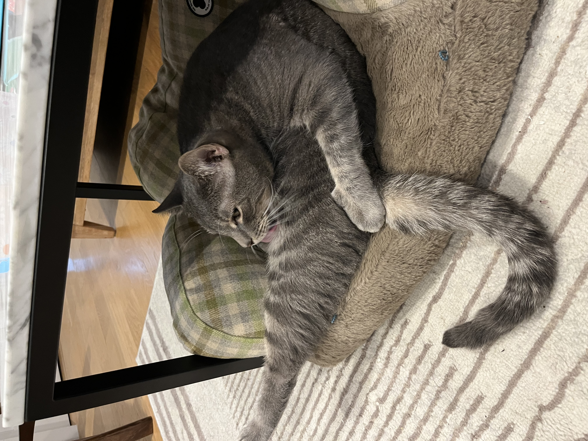
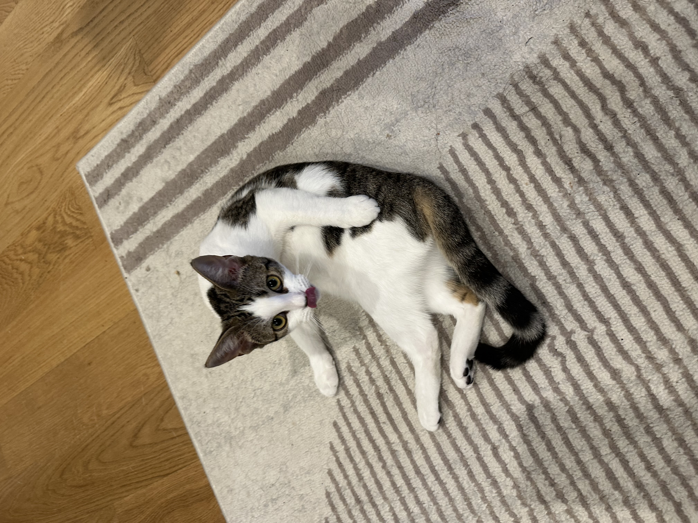

# This is Irene's awesome website

Here's a gif of Elmo

You can add text

* and list
* with extra bullets

You can *FORMAT* and **bold**

This is a [link](https://www.google.com/) to a good data science tool. Here's a link to [P8105](https://p8105.com/). Here's a link to the [about](about.html) page.

# Here's a new section

My roommate's cat is Silver. This is Silver:

Also here's Meimei:

# Other stuff on this page

Definitely there is [plotly](plotly.html) stuff!

